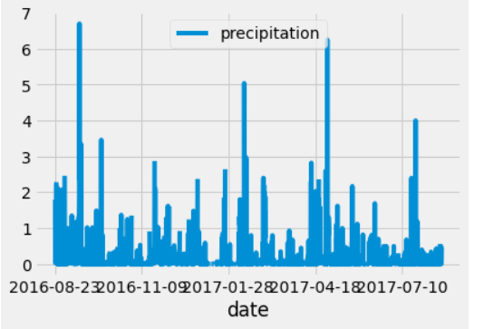

# surfs_up

## Overview: 
W. Avy a savvy entrepenuer tasked us with completing a more detailed analysis for his project than his previous research. His goal 
is to  find tempreture trends for the months of June and December in Oahau before opening. A surf shop in the perfect spot, opening at the
right time would mean success to Avvy and a great vacation experience to vacationers. 

## Results:
1. Perfect weather to surf:
With summer being one of the hottest months in the year it makes June the perfect month to be out on the beach. Based on our research we found that many families are taking 
advantage of the "perfect weather". We also found that with June being such a good time for great weather many surfers plan to hit the the big waves. 

2. Great month for vacationers:
We also found that June maximum tempreature was 85 degrees. Not Bad ! Also, the median Tempreature was found to be 74 degrees. Becasue so many families enjoy this time of the year it made perfect sence to open up our amazing shope in June.

3. Alternate options for Holiday family.
Because we are on the Hawaian Islands, the weather remains normally constant with the exception of precepitation. 
We found, that December was great to vacation as well. Avy had us pull some Data for December as a possible options to open up. We noticed that the Max Tempreature
was not far off from June. With a max of 83 defrees and a median of 71, it made an amazing option. We also know that many families like vacationing to the Island throughout the holiday seasons to get that last splash in the sun. 

 

## Summary:
With our data we found that we do need to keep an eye on the precipitaion months. However we could do a bit more digging to find out total amount of vacationers visit the Islands throughout the biggest tourist seasons. Also, we could look to add what else does fmailies who surf do while surfing. Perhaps we can bring in a few more families to enjoy our Surf shop opening ! Enjoy 

